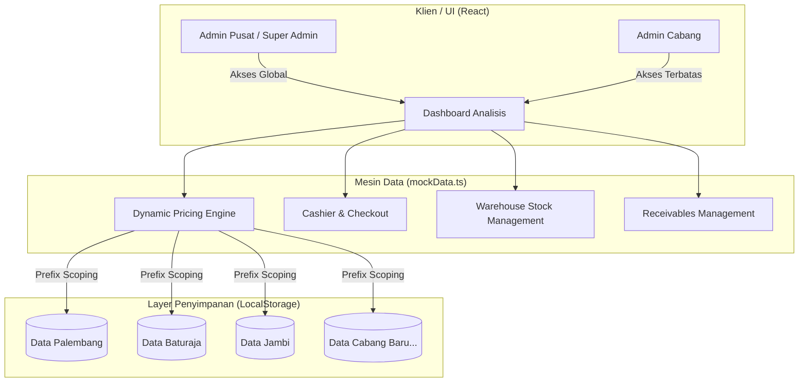

# PT Anugerah Indotirta Raharja — Wholesale Distributor Management Dashboard 🚀

Dashboard manajemen distributor grosir modern dan terintegrasi yang dirancang khusus untuk mengelola produk brand **Fiesta** dan **Shifudo** di berbagai cabang perusahaan. Sistem ini memadukan kemudahan operasional kasir cabang dengan pengawasan performa bisnis terpusat bagi jajaran direksi/Super Admin (Pusat).

Sistem ini didesain dengan estetika premium, performa responsif, serta alur data yang terisolasi secara aman demi efisiensi operasional harian.

---

## 📌 Gambaran Umum Sistem & Arsitektur

Aplikasi ini menggunakan Next.js (App Router) dengan arsitektur frontend modular berbasis React dan TypeScript. Seluruh manajemen status data menggunakan konsep **Branch Isolation** berbasis `localStorage` yang terenkapsulasi secara cerdas.



### 1. Sistem Multi-Cabang & Branch Isolation 🔒
*   **Isolasi Data Sempurna**: Setiap transaksi, piutang, inventaris stock, dan data toko disimpan dengan menggunakan kunci ber-prefix nama cabang (contoh: `wholesale_products_palembang`, `wholesale_orders_baturaja`). Ini memastikan tidak ada kebocoran data antar cabang.
*   **Penyelarasan Master Produk**: Ketika produk baru ditambahkan di satu cabang, sistem secara otomatis mengkloning produk tersebut ke seluruh cabang lain dengan stok awal `0`, menjaga konsistensi katalog produk secara nasional.
*   **Sinkronisasi Global**: Modifikasi nama produk, harga, dan kategori oleh Super Admin akan langsung tersinkronisasi ke seluruh database cabang secara otomatis tanpa mengganggu data stok fisik masing-masing cabang.
*   **Bootstrapping Otomatis**: Saat admin membuat cabang baru, sistem secara otomatis melakukan bootstrap data awal (mock data produk default, kategori, dan template store) sehingga cabang baru langsung siap beroperasi.

---

## 👥 Sistem Peran & Akses Pengguna (Role Management)

Aplikasi memiliki kredensial default yang langsung dapat diuji pada halaman login:

| Cabang (Branch) | Username | Level Akses | Fitur Utama |
| :--- | :--- | :--- | :--- |
| **Pusat** | `superadmin` | **Super Admin** | Konsolidasi seluruh cabang, manajemen akun cabang, master kategori, perubahan harga global. |
| **Palembang** | `palembang` | **Branch Admin** | Kasir lokal, kelola stok gudang, piutang & buku toko wilayah Palembang. |
| **Baturaja** | `baturaja` | **Branch Admin** | Kasir lokal, kelola stok gudang, piutang & buku toko wilayah Baturaja. |
| **Jambi** | `jambi` | **Branch Admin** | Kasir lokal, kelola stok gudang, piutang & buku toko wilayah Jambi. |

---

## 🛠️ Kupas Tuntas Fitur Aplikasi

### 1. Analytics Dashboard Modern 📊
*   **Key Performance Indicators (KPIs)**:
    *   **Penjualan Hari Ini**: Menghitung total omzet pesanan masuk pada tanggal hari ini.
    *   **Penjualan Bulan Ini**: Akumulasi nilai belanja di bulan berjalan.
    *   **Total Piutang**: Menampilkan total outstanding piutang yang belum lunas (dilengkapi indikator warna peringatan jika nilai > 0).
    *   **Stok Menipis**: Jumlah produk dengan sisa stok di bawah 50 pcs untuk tindakan restock cepat.
*   **Visualisasi Data Interaktif (Recharts)**:
    *   *Trend Penjualan Mingguan*: Grafik batang (Bar Chart) 7 hari terakhir dalam satuan ribuan (K) dengan tooltip interaktif.
    *   *Kontribusi Cabang (Super Admin)*: Grafik lingkaran (Donut/Pie Chart) yang menunjukkan presentase andil omzet tiap cabang secara real-time.
*   **Live Widgets**:
    *   Daftar produk kritis yang memerlukan restock mendesak (disertai tag cabang).
    *   Feed pesanan terbaru yang masuk ke dalam sistem.
*   **Daily Sales Report & Export CSV** 📥:
    *   Filter laporan harian berdasarkan kombinasi **Tanggal** dan **Toko Pelanggan**.
    *   Ekspor instan ke format `.csv` yang kompatibel dengan Microsoft Excel dan Google Sheets (Super Admin akan mendapatkan kolom tambahan 'Cabang' pada file ekspor).

### 2. Sistem Kasir & Katalog Pemesanan (Store Cashier) 🛒
*   **Batas Kategori Keranjang (Cart Category Lock)** 🚫:
    *   Guna menyederhanakan administrasi faktur penjualan dan pencatatan pajak, sistem menerapkan aturan ketat: **Produk Fiesta dan Shifudo tidak boleh digabung dalam satu nota bon belanja (Invoice)**.
    *   *UX Pintar*: Keranjang akan terkunci otomatis pada kategori produk yang pertama kali dimasukkan. Jika admin mencoba memasukkan produk dari brand lain, sistem akan menampilkan notifikasi penolakan (Toaster Warning) dan menyediakan tombol cepat "Kosongkan Keranjang" untuk beralih kategori.
*   **Manajemen Pemesanan Fleksibel**:
    *   *Validasi Stok*: Tombol tambah barang otomatis dinonaktifkan jika stok fisik di gudang habis atau kuantitas keranjang telah mencapai batas maksimal stok yang tersedia.
    *   *Form Checkout Komprehensif*: Memerlukan input **Nomor Faktur (Invoice ID)** yang akan divalidasi keunikannya di database untuk mencegah double-entry data, serta **Tanggal Pesanan** kustom.
    *   *Efek Samping Checkout*: Menambah pesanan cabang, memotong stok fisik gudang (`totalOut` bertambah, `stock` berkurang), menambah utang toko pelanggan, dan menerbitkan Piutang baru dengan masa jatuh tempo standar **30 hari**.

### 3. Riwayat Pesanan & Audit Log (Order History) 📜
*   **Pencarian & Penyaringan Lanjut**:
    *   Mode filter fleksibel: **Harian** (menggunakan Date Picker) atau **Bulanan** (menggunakan Month Picker).
    *   Penyaringan berdasarkan *Toko*, *Brand*, dan *Cabang* (khusus Super Admin).
*   **Detail Transaksi Fleksibel (Accordion Rows)**:
    *   Setiap baris pesanan dapat di-expand untuk menampilkan rincian barang belanjaan (nama produk, qty, harga satuan saat transaksi, dan subtotal harga).
*   **Ekspor Data Penjualan**: Dukungan ekspor laporan penjualan yang telah difilter ke file CSV untuk keperluan audit bulanan.

### 4. Manajemen Stok Gudang (Warehouse Inventory) 📦
*   **Indikator Status Stok HSL**:
    *   `Stok Habis` (merah menyala): Kuantitas `0`.
    *   `Stok Menipis` (amber/oranye): Kuantitas `< 50`.
    *   `Stok Aman` (hijau emerald): Kuantitas `>= 50`.
*   **Quick Restock Engine**:
    *   Modal interaktif untuk menambahkan stok masuk secara instan.
    *   *Formula Konsistensi*: Sistem otomatis menjaga rumus matematika baku: `Stok = Total Masuk (totalIn) - Total Keluar (totalOut)`. Jika stok disesuaikan secara manual, variabel `totalIn` akan disesuaikan secara matematis agar riwayat tetap konsisten.
*   **Export Buku Stok**: Ekspor buku inventaris aktif per cabang ke CSV.

### 5. Pengelolaan Piutang Toko (Accounts Receivable) 💸
*   **Sistem Peringatan Jatuh Tempo (Overdue Alert)**:
    *   Baris piutang otomatis berubah warna menjadi merah lembut dan memunculkan badge **"Jatuh Tempo"** jika tanggal hari ini telah melewati tanggal jatuh tempo faktur.
*   **Ringkasan Utang per Toko**:
    *   Mengelompokkan piutang secara cerdas berdasarkan toko pelanggan untuk memantau akumulasi utang masing-masing toko secara kumulatif.
*   **Pelunasan Sekali Klik (One-Click Settlement)**:
    *   Tombol "Tandai Lunas" akan langsung mengubah status piutang, mencatatnya ke dalam riwayat lunas, dan secara otomatis memotong jumlah `totalDebt` pada Buku Toko terkait secara real-time.

### 6. Buku Toko Pelanggan (Store Ledger) 🏪
*   **Registrasi & Operasional Toko**:
    *   Tambah toko baru secara instan di bawah cabang aktif.
    *   Ubah nama toko secara inline dan hapus toko dengan validasi konfirmasi pengaman.
*   **Profil Detil Pelanggan**:
    *   Pilih toko dari daftar samping untuk memuat profil lengkap toko, total akumulasi utang aktif, jumlah transaksi historis, dan semua rincian faktur belanja historis milik toko tersebut.

### 7. Buku Produk & Dynamic Pricing Engine v2 (Product Ledger) 🏷️
Ini adalah inti kecerdasan sistem manajemen inventaris kami:
*   **Tambah/Hapus Produk Global**: Melakukan operasi CRUD produk yang menyebar ke seluruh cabang perusahaan secara sinkron.
*   **Dynamic Price Changes**: Perubahan nama atau harga dasar produk oleh Super Admin langsung disebarluas ke seluruh cabang saat itu juga.
*   **Scheduled Price Change (Jadwal Harga Masa Depan)** 📅:
    *   Super Admin dapat mengatur jadwal perubahan harga di masa mendatang (contoh: Kenaikan harga Fiesta Nugget per tanggal 1 bulan depan).
    *   Sistem akan secara pasif memonitor tanggal. Saat fungsi dipicu (aplikasi dijalankan atau halaman produk diakses), sistem akan mendeteksi jika tanggal berlaku telah tercapai dan mengaktifkan harga baru tersebut secara otomatis.
*   **Retroactive Price Correction (Koreksi Berlaku Surut / Backdate)** ⚡:
    *   *Kasus Penting*: Bagaimana jika ada revisi harga dari produsen yang berlaku surut (backdate)? 
    *   *Solusi Cerdas*: Jika tanggal mulai berlaku yang dipilih untuk perubahan harga adalah tanggal di masa lalu, **Dynamic Pricing Engine** akan menyusuri seluruh faktur pesanan (Orders) lama mulai dari tanggal tersebut hingga hari ini.
    *   Sistem akan menghitung ulang total belanja pada faktur terdampak serta mengoreksi nominal Piutang terkait secara otomatis!
    *   *Audit Safe*: Faktur yang piutangnya **telah lunas** akan dilewati secara otomatis untuk mencegah kekacauan pembukuan keuangan yang sudah diaudit.

### 8. Manajemen Akun Cabang (Super Admin Console) 👥
*   **Expand Business**: Super Admin dapat mendaftarkan cabang baru secara instan (misal: "Lampung").
*   **Kredensial Unik**: Menentukan username dan password masuk khusus untuk administrator cabang tersebut.
*   **Auto Data Bootstrapping**: Setelah akun baru disimpan, sistem akan secara otomatis menyiapkan katalog produk Fiesta & Shifudo awal dengan stok `0` serta membuat toko simulasi agar admin cabang baru dapat langsung bertransaksi.

---

## 🛠️ Tech Stack & Dependensi

Proyek ini dibangun di atas teknologi modern berkinerja tinggi:

*   **Framework**: [Next.js 15+](https://nextjs.org/) (React 18/19, TypeScript)
*   **Styling**: Vanilla CSS & [Tailwind CSS v4](https://tailwindcss.com/) (Aesthetics premium dengan visual shadow, rounded card, glassmorphism, dan gradasi warna modern)
*   **Icons**: [Lucide React](https://lucide.dev/) (Set ikon vektor yang konsisten)
*   **Charts**: [Recharts](https://recharts.org/) (Library grafik interaktif yang responsif)
*   **Toasts**: [Sonner](https://sonner.kemalydn.com/) (Notifikasi toast premium dengan rich colors)
*   **Animations**: Motion (untuk micro-animations yang mulus) & Tailwind transition utilities.
*   **Database Klien**: `localStorage` (Dengan skema dynamic branch prefix).

---

## 📦 Cara Menjalankan Project Secara Lokal

Ikuti langkah-langkah di bawah ini untuk menjalankan aplikasi di komputer Anda:

### 1. Clone & Masuk Direktori
```bash
git clone <url-repository>
cd Wholesale-Distributor-Dashboard
```

### 2. Instalasi Dependensi
Gunakan npm untuk menginstal semua package yang diperlukan:
```bash
npm install
```

### 3. Jalankan Mode Pengembangan (Development)
Jalankan perintah berikut untuk memulai server Next.js lokal:
```bash
npm run dev
```
Setelah berjalan, buka browser Anda dan akses halaman: **`http://localhost:3000`**

### 4. Login Aplikasi
Gunakan salah satu kredensial akun yang tertera di [Sistem Peran & Akses](#-sistem-peran--akses-pengguna-role-management) untuk menguji fitur sebagai Super Admin (Pusat) atau Admin Cabang (Palembang/Baturaja/Jambi).

---

Developed with ❤️ by **PT Anugerah Indotirta Raharja Tech Team**.
*Copyright © 2026. All rights reserved.*